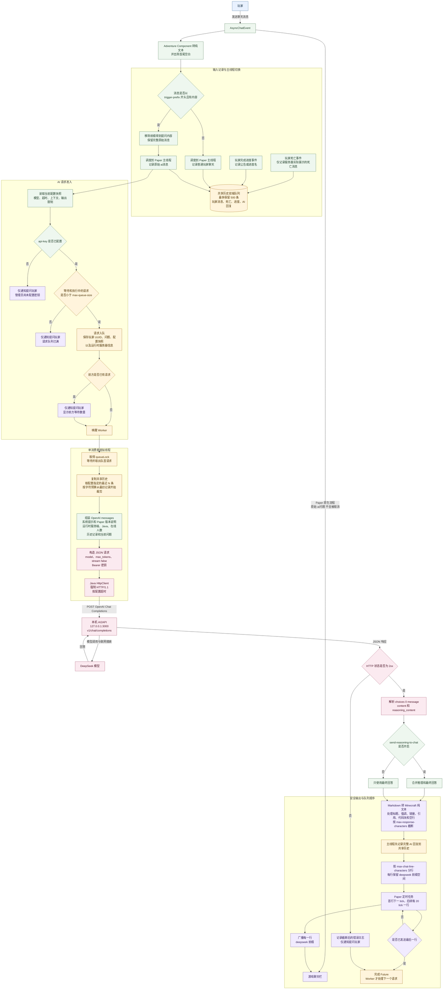
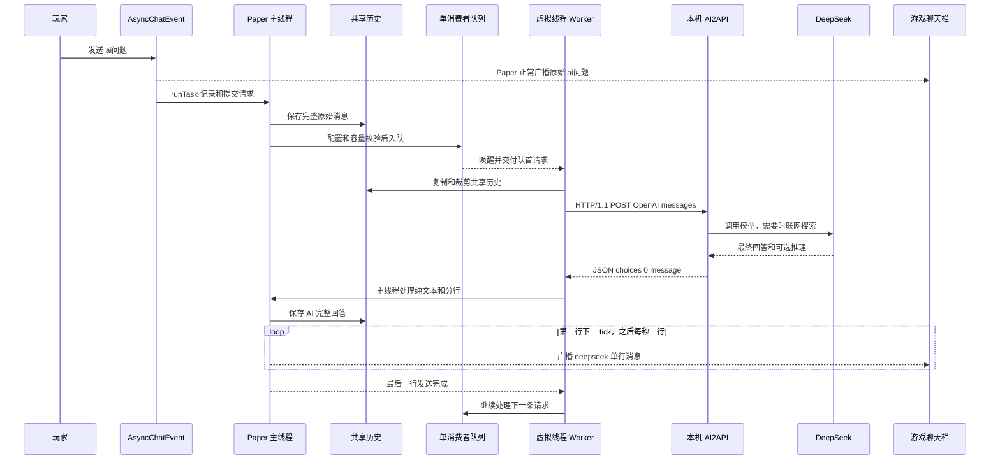

# mc-chat-deepseek-ai2api

让 Paper 服务器中的所有玩家直接通过聊天栏使用本机 AI2API 的 DeepSeek 模型。玩家发送以 `ai` 开头的消息即可提问，例如 `ai最近 GitHub 有什么热门仓库`、`aimc 马鞍怎么合成`。AI 的回答会以 `<deepseek>` 的聊天前缀广播给在线玩家。

## 特性

- 所有玩家都可使用，不设置每日额度或每玩家配额。
- 所有玩家和 AI 共用近期聊天上下文；每次请求默认附带最近 500 条记录。
- 单消费者队列依次处理请求，网络请求不会占用服务器主线程；默认最多容纳 256 个等待或执行中的请求，避免异常刷请求耗尽内存。
- 默认模型为 `deepseek-thinking-search`，默认上下文窗口预算为 512k，最大生成 8192 tokens。
- 模型的推理字段默认不发往游戏聊天，可在配置中开启。
- 回复会先转为 Minecraft 可读的纯文本，再从第一行开始每秒发送一行；同一时间只播报一段 AI 回复，避免多位玩家的回答交错。
- 管理员可执行 `/mc-chat-deepseek-ai2api reload` 安全重载配置；配置不合法时保留当前生效配置。

## 详细通信流程



## 请求时序



玩家的原始 `ai...` 消息不会被插件隐藏。队列一次只执行一条请求，并等待当前回答全部逐行发完后才开始下一条，因此共享上下文与聊天输出不会被并发回答打乱。

## 环境与兼容性

本项目按 Paper `26.2.build.87-stable` 和 Java 25 编译，使用 Paper 的 `AsyncChatEvent` 监听聊天，因此目标环境为 Paper 26.2 或提供该事件的兼容实现。它不以 Spigot 为目标，也不保证旧版 Paper、Spigot 或 Purpur 可直接运行。

每次调用都向模型附带当前服务端实现、Minecraft 版本标识、Java 版本和在线人数。默认系统提示特别说明 **Paper 26.2 是真实存在的当前版本标识，不是 Minecraft 1.26，也不是幻觉或笔误**，以减少模型对新版本信息的误判。

## 安装

将构建出的 JAR 放入服务端 `plugins/` 目录，首次启动后编辑：

`plugins/mc-chat-deepseek-ai2api/config.yml`

至少填写 `api-key`。默认接口地址为本机 AI2API：

`http://127.0.0.1:3000/v1/chat/completions`

其余字段均在配置文件中带有中文注释，包括可用模型、上下文、队列、超时和聊天输出长度。修改后执行：

```text
/mc-chat-deepseek-ai2api reload
```

该命令需要 `mc-chat-deepseek-ai2api.admin` 权限，默认仅 OP 具备。

## AI2API 请求格式

插件使用 OpenAI Chat Completions 兼容格式，向以下站点发送 `POST` 请求：

`http://127.0.0.1:3000/v1/chat/completions`

独立测试可使用：

```bash
curl http://127.0.0.1:3000/v1/chat/completions \
  -H "Authorization: Bearer $AI2API_KEY" \
  -H "Content-Type: application/json" \
  --data '{"model":"deepseek-thinking-search","messages":[{"role":"user","content":"你好"}]}'
```

仓库配置中的密钥仅为临时公开测试用途。使用自己的密钥时，请只保存在服务器本地配置或环境变量中，不要提交到代码仓库或公开文档。

## 构建

需要 Java 25 和 Maven：

```bash
mvn clean package
```

成品位于 `target/mc-chat-deepseek-ai2api-1.0.0.jar`。JAR 已内置并重定位 Gson，不会与其他插件的 Gson 版本冲突。
